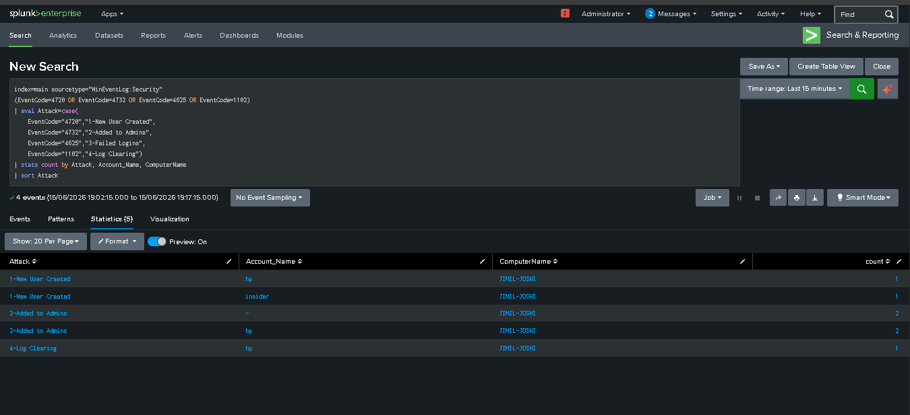
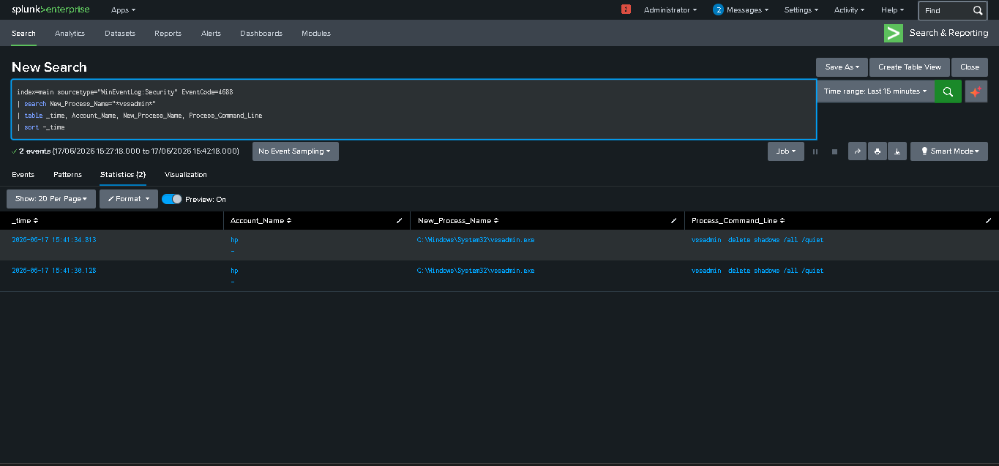
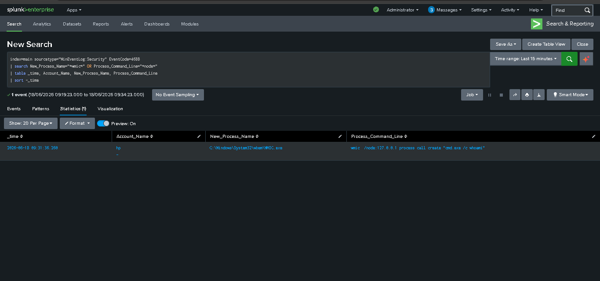
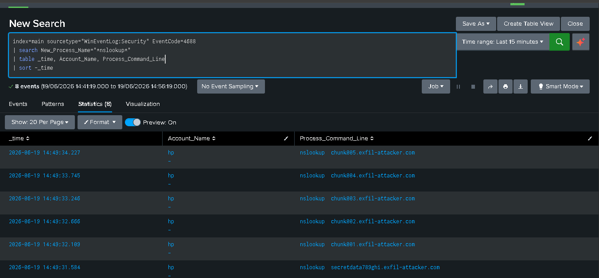
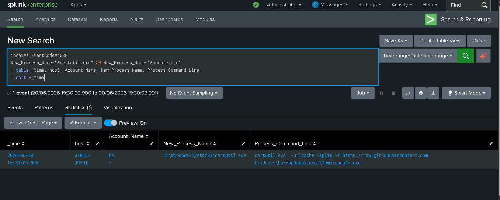

# 🛡️ SOC Level 1 — Splunk Home Lab

> A hands-on SOC L1 home lab built to practice real-world threat detection, log analysis, and incident investigation using Splunk SIEM.

---

## 👨‍💻 About This Project

This repository documents my SOC Level 1 home lab where I simulate attacks on my own machine and use **Splunk** to detect, investigate, and report on them — just like a real SOC analyst would.

**Tools Used:**
- Splunk Enterprise (local)
- Windows Security Event Logs
- Windows System Event Logs
- Windows PowerShell Operational Logs
- Windows Firewall Logs
- Windows DNS Client Logs
- MITRE ATT&CK Framework

---

## 📁 Repository Structure

```
SOC-Lab-Splunk/
│
├── README.md
│
├── SPL-Queries/
│   ├── (16 lab .spl files)
│   ├── insider_threat_detection.spl
│   ├── ransomware_detection.spl
│   ├── lateral_movement_detection.spl
│   ├── data_exfiltration_detection.spl
│   └── Scenario_05_Phishing_Attack.spl
│
├── Investigation-Reports/
│   ├── (16 lab .md files)
│   ├── insider_threat_IR-2026-002.md
│   ├── ransomware_IR-2026-003.md
│   ├── lateral_movement_IR-2026-004.md
│   ├── data_exfiltration_IR-2026-005.md
│   └── Scenario_05_Phishing_Attack.md
│
├── Incident-Reports/
│   ├── SOC_Incident_Report_IR-2026-001.docx
│   ├── IR-2026-002_Insider_Threat.docx
│   ├── IR-2026-003_Ransomware.docx
│   ├── IR-2026-004_Lateral_Movement.docx
│   ├── IR-2026-005_Data_Exfiltration.docx
│   └── IR-2026-006_Phishing_Attack.docx
│
├── Scenarios/
│   ├── Scenario_01_Insider_Threat/
│   │   └── README.md
│   ├── Scenario_02_Ransomware/
│   │   └── README.md
│   ├── Scenario_03_Lateral_Movement/
│   │   └── README.md
│   ├── Scenario_04_Data_Exfiltration/
│   │   └── README.md
│   └── Scenario_05_Phishing_Attack/
│       └── README.md
│
├── Dashboards/
│   └── soc_security_dashboard.xml
│
└── screenshots/
    └── (50+ evidence screenshots)
```

---

# 🔬 PART 1 — 16 LAB SIMULATIONS

> Hands-on attack simulations using real Windows Event Logs detected in Splunk

---

## 📊 Labs Overview

| # | Attack Simulated | Event ID | MITRE ATT&CK | Severity | Status |
|---|---|---|---|---|---|
| 1 | Brute Force Login | 4625 | T1110 | Medium | ✅ Done |
| 2 | New User Account Created | 4720 | T1136 | High | ✅ Done |
| 3 | Account Lockout | 4740 | T1110 | High | ✅ Done |
| 4 | User Added to Admin Group | 4732 | T1098 | Critical | ✅ Done |
| 5 | RDP & Interactive Login | 4624 | T1078 / T1021.001 | Medium-High | ✅ Done |
| 6 | Suspicious PowerShell | 4104 | T1059.001 / T1027 | High-Critical | ✅ Done |
| 7 | Process Creation | 4688 | T1059 / T1087 | High | ✅ Done |
| 8 | Log Clearing | 1102 | T1070.001 | Critical | ✅ Done |
| 9 | Firewall Disabled | 4104/4950 | T1562.004 | Critical | ✅ Done |
| 10 | Scheduled Task Created | 4104/4698 | T1053.005 | High | ✅ Done |
| 11 | Malicious Service Installed | 7045 | T1543.003 | Critical | ✅ Done |
| 12 | Port Scan Detection | Firewall Log | T1046 | High | ✅ Done |
| 13 | DNS Query Analysis | DNS Log | T1071.004 | High | ✅ Done |
| 14 | SOC Security Dashboard | All Events | All | — | ✅ Done |
| 15 | Splunk Alerts | All Events | All | — | ✅ Done |
| 16 | Correlation Rules | All Events | Multiple | Critical | ✅ Done |

---

## 🧪 Lab 1 — Brute Force Detection
### SPL Query
```spl
index=main sourcetype="WinEventLog:Security" EventCode=4625
| stats count by Account_Name, ComputerName
| where count >= 5
| sort -count
```
### Result
Splunk detected **7 failed login attempts** against account `hp` on host `JIMIL-JOSHI`.
📄 [Investigation Report](Investigation-Reports/brute_force_investigation.md)


---

## 🧪 Lab 2 — New User Account Created
### SPL Query
```spl
index=main sourcetype="WinEventLog:Security" EventCode=4720
| table _time, Account_Name, ComputerName, Security_ID
```
### Result
Splunk detected creation of backdoor account `hacker` by `hp` on `JIMIL-JOSHI`.
📄 [Investigation Report](Investigation-Reports/new_user_investigation.md)


---

## 🧪 Lab 3 — Account Lockout Detection
### SPL Query
```spl
index=main sourcetype="WinEventLog:Security" EventCode=4740
| table _time, Account_Name, ComputerName, Caller_Computer_Name
```
### Result
Splunk detected account lockout of `hp` on host `JIMIL-JOSHI`.
📄 [Investigation Report](Investigation-Reports/account_lockout_investigation.md)


---

## 🧪 Lab 4 — User Added to Administrators Group
### SPL Query
```spl
index=main sourcetype="WinEventLog:Security" EventCode=4732
| table _time, Account_Name, ComputerName, Security_ID, Member_Security_ID
```
### Result
Splunk detected **5 group membership changes** by `hp` on `JIMIL-JOSHI`.
📄 [Investigation Report](Investigation-Reports/admin_group_investigation.md)


---

## 🧪 Lab 5 — RDP & Interactive Login Detection
### SPL Query
```spl
index=main sourcetype="WinEventLog:Security" EventCode=4624
| where Logon_Type=2
| stats count by Account_Name, ComputerName, Logon_Type
| sort -count
```
### Result
Splunk detected **4 successful interactive logins** by `hp` on `JIMIL-JOSHI`.
📄 [Investigation Report](Investigation-Reports/rdp_login_investigation.md)


---

## 🧪 Lab 6 — Suspicious PowerShell + Threat Hunting

### Part 1 — Basic Recon
```spl
index=main EventCode=4104
| table _time, ComputerName, Message
| sort -_time
```

### Part 2 — Advanced Threat Hunting
```spl
index=main EventCode=4104
| search Message="*Invoke*" OR Message="*WebClient*" OR Message="*ToBase64*" OR Message="*payload*"
| table _time, ComputerName, Message
| sort -_time
```
### Result
Detected **20 recon events** + **5 high risk events** including `Net.WebClient`, `Invoke-Expression`, `ToBase64String`.
📄 [Investigation Report](Investigation-Reports/powershell_investigation_v2.md)


---

## 🧪 Lab 7 — Process Creation Detection
### SPL Query
```spl
index=main sourcetype="WinEventLog:Security" EventCode=4688
| search New_Process_Name="*cmd.exe*" OR New_Process_Name="*net.exe*" OR New_Process_Name="*whoami*"
| table _time, Account_Name, New_Process_Name, Process_Command_Line
| sort -_time
| head 10
```
### Result
Splunk detected **613 process events** — `whoami` and `net localgroup administrators` confirmed.
📄 [Investigation Report](Investigation-Reports/process_creation_investigation.md)


---

## 🧪 Lab 8 — Log Clearing Detection
### SPL Query
```spl
index=main sourcetype="WinEventLog:Security" EventCode=1102
| table _time, ComputerName, Account_Name, Message
| sort -_time
```
### Result
Splunk detected **2 log clearing events** — "The audit log was cleared" confirmed.
📄 [Investigation Report](Investigation-Reports/log_clearing_investigation.md)


---

## 🧪 Lab 9 — Windows Firewall Disabled
### SPL Query
```spl
index=main EventCode=4104
| search Message="*NetFirewall*" OR Message="*Enabled False*" OR Message="*Enabled True*"
| table _time, ComputerName, Message
| sort -_time
| head 20
```
### Result
Splunk detected **74 events** — `Set-NetFirewallProfile -Enabled False` confirmed.
📄 [Investigation Report](Investigation-Reports/firewall_disabled_investigation.md)


---

## 🧪 Lab 10 — Scheduled Task Created
### SPL Query
```spl
index=main EventCode=4104
| search Message="*schtasks*" OR Message="*ScheduledTask*" OR Message="*WindowsUpdate*"
| table _time, ComputerName, Message
| sort -_time
| head 20
```
### Result
Splunk detected **27 events** — suspicious task `WindowsUpdate` detected on `JIMIL-JOSHI`.
📄 [Investigation Report](Investigation-Reports/scheduled_task_investigation.md)


---

## 🧪 Lab 11 — Malicious Service Installed
### SPL Query
```spl
index=main sourcetype="WinEventLog:System" EventCode=7045
| table _time, ComputerName, Message
| sort -_time
```
### Result
Splunk detected `FakeService` — binary `cmd.exe /c whoami` — auto start as LocalSystem.
📄 [Investigation Report](Investigation-Reports/service_installed_investigation.md)


---

## 🧪 Lab 12 — Port Scan Detection
### SPL Query
```spl
index=main sourcetype="firewall_log"
| rex field=_raw "(?P<action>\w+)\s+(?P<protocol>\w+)\s+(?P<src_ip>[\d.]+)\s+(?P<dst_ip>[\d.]+)\s+(?P<src_port>\d+)\s+(?P<dst_port>\d+)"
| stats count by dst_port, action
| sort -count
| head 20
```
### Result
Splunk detected **1,527 firewall events** — port scan across 1024 ports confirmed.
📄 [Investigation Report](Investigation-Reports/port_scan_investigation.md)


---

## 🧪 Lab 13 — DNS Query Analysis
### SPL Query
```spl
index=main sourcetype="WinEventLog:Microsoft-Windows-DNS-Client/Operational"
| rex field=_raw "(?P<domain>[a-zA-Z0-9.-]+\.[a-zA-Z]{2,})"
| stats count by domain
| sort -count
| head 20
```
### Result
Splunk detected **853 DNS events** — suspicious query for `suspicious-domain.xyz` confirmed.
📄 [Investigation Report](Investigation-Reports/dns_analysis_investigation.md)


---

## 🧪 Lab 14 — SOC Security Dashboard

### Dashboard Metrics
| Panel | Count |
|---|---|
| Failed Login Attempts | 38 |
| New User Accounts Created | 4 |
| Log Clearing Events | 2 |
| Privilege Escalation Events | 10 |
| Malicious Services Installed | 16 |
| Account Lockouts | 1 |
| PowerShell Events | 679 |
| Process Creation Events | 121,457 |

📄 [Dashboard Report](Investigation-Reports/soc_dashboard_report.md)
📄 [Dashboard XML](Dashboards/soc_security_dashboard.xml)


---

## 🧪 Lab 15 — Splunk Alerts

### Alerts Created
| Alert | Event ID | Severity | Status |
|---|---|---|---|
| Brute Force Detection | 4625 | 🟠 High | ✅ Enabled |
| Log Clearing — Critical | 1102 | 🔴 Critical | ✅ Enabled |
| New User Created | 4720 | 🟠 High | ✅ Enabled |
| Privilege Escalation | 4732 | 🔴 Critical | ✅ Enabled |
| Malicious Service Installed | 7045 | 🔴 Critical | ✅ Enabled |

### Result
Brute Force alert triggered **6 times** — automated detection confirmed working!
📄 [Alerts Report](Investigation-Reports/splunk_alerts_report.md)


---

## 🧪 Lab 16 — Advanced Correlation Rules

### Rule 1 — Brute Force Then Successful Login
```spl
index=main sourcetype="WinEventLog:Security"
| eval event_type=case(EventCode="4625","Failed Login", EventCode="4624","Successful Login")
| where isnotnull(event_type)
| stats count(eval(EventCode="4625")) as failed_count, count(eval(EventCode="4624")) as success_count by Account_Name, ComputerName
| where failed_count >= 3 AND success_count >= 1
| eval risk="HIGH — Possible Successful Brute Force!"
| table Account_Name, ComputerName, failed_count, success_count, risk
```
**Result:** `hp` — 18 failed + 12 successful logins 🔴

### Rule 2 — Backdoor Admin Account
```spl
index=main sourcetype="WinEventLog:Security" EventCode=4720 OR EventCode=4732
| stats count(eval(EventCode="4720")) as new_user, count(eval(EventCode="4732")) as added_to_admin by Account_Name, ComputerName
| where new_user >= 1 AND added_to_admin >= 1
| eval risk="CRITICAL — Backdoor Admin Account Created!"
| table Account_Name, ComputerName, new_user, added_to_admin, risk
```
**Result:** `hp` — 2 new users + 3 added to Admins 🔴

### Rule 3 — Attack Then Evidence Destroyed
```spl
index=main sourcetype="WinEventLog:Security" EventCode=4625 OR EventCode=1102
| stats count(eval(EventCode="4625")) as failed_logins, count(eval(EventCode="1102")) as log_cleared by Account_Name, ComputerName
| where failed_logins >= 3 AND log_cleared >= 1
| eval risk="CRITICAL — Attack then Evidence Destroyed!"
| table Account_Name, ComputerName, failed_logins, log_cleared, risk
```
**Result:** `hp` — 18 failed logins + 3 log clearing events 🔴

📄 [Investigation Report](Investigation-Reports/correlation_rules_investigation.md)


---
---

# 🎯 PART 2 — ADVANCED SCENARIOS

> Real-world attack scenarios combining multiple techniques — advanced SOC investigation practice

---

## 📊 Scenarios Overview

| # | Scenario | MITRE ATT&CK | Severity | Status |
|---|---|---|---|---|
| 1 | Insider Threat Detection | T1136 / T1098 / T1070.001 | 🔴 Critical | ✅ Completed |
| 2 | Ransomware Detection | T1486 / T1490 | 🔴 Critical | ✅ Completed |
| 3 | Lateral Movement Detection | T1021 / T1021.002 / T1047 | 🔴 Critical | ✅ Completed |
| 4 | Data Exfiltration Detection | T1560 / T1048 / T1071.004 | 🔴 Critical | ✅ Completed |
| 5 | Phishing Attack Detection | T1566.001 / T1204.002 / T1105 | 🟠 High | ✅ Completed |

---

## 🎯 Scenario 01 — Insider Threat Detection

### Story
> A disgruntled employee creates a backdoor admin account before leaving the company, then clears the security logs to destroy evidence. SOC analyst must detect the complete attack chain!

### Attack Chain
```
Backdoor account 'insider' created (4720) → Added to Admins (4732) → Logs cleared (1102)
```

### Verdict
**✅ TRUE POSITIVE — Complete Insider Threat Attack Chain Detected!**

📄 [Investigation Report](Investigation-Reports/insider_threat_IR-2026-002.md) | 📄 [Scenario Details](Scenarios/Scenario_01_Insider_Threat/README.md) | 📄 [Incident Report](Incident-Reports/IR-2026-002_Insider_Threat.docx)



---

## 🎯 Scenario 02 — Ransomware Detection

### Story
> An employee opens a malicious attachment. Files are renamed with a `.locked` extension and shadow copies are deleted to prevent recovery. SOC analyst must detect the ransomware behavior!

### Attack Chain
```
Files renamed to .locked → Shadow copies deleted via vssadmin (4688) → Ransom note dropped
```

### Real SOC Lesson
Initial query caused false positives matching "ren" in unrelated processes — tuned to keep only high-confidence indicators. A detection gap was also found: shell built-ins (`echo`, `ren`) don't generate Event 4688 entries.

### Verdict
**✅ TRUE POSITIVE — Ransomware Behavior Confirmed**

📄 [Investigation Report](Investigation-Reports/ransomware_IR-2026-003.md) | 📄 [Scenario Details](Scenarios/Scenario_02_Ransomware/README.md) | 📄 [Incident Report](Incident-Reports/IR-2026-003_Ransomware.docx)



---

## 🎯 Scenario 03 — Lateral Movement Detection

### Story
> An attacker who has compromised one account attempts to move across the network using Windows admin shares and WMI remote execution. SOC analyst must detect this movement!

### Attack Chain
```
C$/ADMIN$ share accessed → Network Logon Type 3 (4624) → WMI remote execution (4688)
```

### Real SOC Insight
Account `hp`'s baseline is Interactive logon (Type 2). The appearance of Network logon (Type 3) alongside admin share access is a measurable behavioral anomaly.

### Verdict
**✅ TRUE POSITIVE — Lateral Movement Technique Confirmed**

📄 [Investigation Report](Investigation-Reports/lateral_movement_IR-2026-004.md) | 📄 [Scenario Details](Scenarios/Scenario_03_Lateral_Movement/README.md) | 📄 [Incident Report](Incident-Reports/IR-2026-004_Lateral_Movement.docx)



---

## 🎯 Scenario 04 — Data Exfiltration Detection

### Story
> An attacker gathers sensitive files, compresses them (staging), then exfiltrates the data via DNS tunneling — encoding stolen data as subdomains of an attacker-controlled domain.

### Attack Chain
```
Files compressed (Compress-Archive, 4688) → 8 DNS queries to exfil-attacker.com in ~4 seconds
```

### Real SOC Lesson — Multi-Source Detection
The dedicated DNS Client Operational log returned 0 events. A broader search revealed the evidence was fully captured instead via Event ID 4688 (Process Creation), since `nslookup` invocations are logged as processes. Demonstrates the importance of knowing multiple log sources for the same activity.

### Verdict
**✅ TRUE POSITIVE — Data Exfiltration Confirmed**

📄 [Investigation Report](Investigation-Reports/data_exfiltration_IR-2026-005.md) | 📄 [Scenario Details](Scenarios/Scenario_04_Data_Exfiltration/README.md) | 📄 [Incident Report](Incident-Reports/IR-2026-005_Data_Exfiltration.docx)



---

## 🎯 Scenario 05 — Phishing Attack Detection

### Story
> A user receives a phishing email disguised as an invoice. Opening the attachment triggers a simulated malicious macro, which spawns a Living-off-the-Land Binary (`certutil.exe`) to download a second-stage payload — which is then executed. SOC analyst must reconstruct the chain from endpoint telemetry alone, since no email gateway log source was available.

### Attack Chain
```
Macro trigger (simulated) → certutil LOLBin payload download (4688) → Payload execution attempt (simulated)
```

### Real SOC Lesson — LOLBin Detection & Honest Limitations
The highest-confidence detection in this scenario was the `certutil -urlcache -split -f` pattern — a well-known LOLBin abuse technique with very low false-positive risk. A detection gap was also identified: the dropped payload (`update.exe`) never generated its own independent Event 4688 entry, since the simulated file was a non-functional placeholder rather than a real executable. Documented transparently as a simulation limitation rather than a detection failure.

### Verdict
**✅ TRUE POSITIVE — Simulated Phishing Execution Chain Confirmed**

📄 [Investigation Report](Investigation-Reports/Scenario_05_Phishing_Attack.md) | 📄 [Scenario Details](Scenarios/Scenario_05_Phishing_Attack/README.md) | 📄 [Incident Report](Incident-Reports/IR-2026-006_Phishing_Attack.docx)



---

## 🎯 Skills Demonstrated

- Windows Security & System Event Log analysis
- PowerShell Script Block Log analysis
- Windows Firewall & DNS Log analysis
- Process Creation & Command Line logging
- Anti-forensics & defense evasion detection
- Persistence & privilege escalation detection
- Insider threat detection
- Ransomware behavior detection
- Lateral movement detection (admin shares + WMI)
- Data exfiltration & DNS tunneling detection
- Phishing & LOLBin abuse detection (certutil)
- Behavioral baseline / anomaly analysis
- Detection rule tuning & false positive reduction
- Multi-source log correlation & detection gap analysis
- Port scan & DNS C2 detection
- Advanced correlation rule development
- Multi-event attack chain detection
- SPL query writing and optimization
- Splunk Dashboard & Alert configuration
- Professional incident documentation
- MITRE ATT&CK framework mapping
- Threat hunting techniques

---

## 🏆 Certifications

| Certificate | Issuer | Date |
|---|---|---|
| SOC Level 1 Learning Path — 65hrs (THM-7FX2PT6FWN) | TryHackMe | Apr 2026 |
| Cyber Job Simulation — Cybersecurity | Deloitte (Forage) | Apr 2026 |
| Cybersecurity Analyst Simulation — IAM | TATA (Forage) | Apr 2026 |
| Cyber Smart — Basic Cyber Security | Ministry of Home Affairs, India | May 2026 |

---

## 🚀 Coming Next

- [ ] Scenario 06 — LOLBins & Execution Abuse (T1218)
- [ ] Scenario 07 — Persistence via Registry Run Keys (T1547.001)
- [ ] Scenario 08 — Defense Evasion / AV Tampering (T1562.001)
- [ ] Scenario 09 — Credential Dumping (T1003)
- [ ] Scenario 10 — Password Spray (T1110)
- [ ] BOTS (Boss of the SOC) Investigation

---

## 📬 Connect

**Jimil Joshi** — Aspiring SOC Analyst
🔗 [LinkedIn](https://www.linkedin.com/in/jimil-joshi-soc-analyst)
🔗 [GitHub](https://github.com/jimil-joshi-8115)
