# 🛡️ SOC Level 1 — Splunk Home Lab

> A hands-on SOC L1 home lab built to practice real-world threat detection, log analysis, and incident investigation using Splunk SIEM.

---

## 👨‍💻 About This Project

This repository documents my SOC Level 1 home lab where I simulate attacks on my own machine and use **Splunk** to detect, investigate, and report on them — just like a real SOC analyst would.

**Tools Used:**
- Splunk Enterprise (local)
- Windows Security Event Logs
- Windows System Event Logs
- Windows PowerShell Operational Logs
- Windows Firewall Logs
- Windows DNS Client Logs
- MITRE ATT&CK Framework

---

## 🔍 Investigations

| # | Attack Simulated | Event ID | MITRE ATT&CK | Severity | Status |
|---|---|---|---|---|---|
| 1 | Brute Force Login | 4625 | T1110 | Medium | ✅ Completed |
| 2 | New User Account Created | 4720 | T1136 | High | ✅ Completed |
| 3 | Account Lockout | 4740 | T1110 | High | ✅ Completed |
| 4 | User Added to Admin Group | 4732 | T1098 | Critical | ✅ Completed |
| 5 | RDP & Interactive Login | 4624 | T1078 / T1021.001 | Medium-High | ✅ Completed |
| 6 | Suspicious PowerShell | 4104 | T1059.001 / T1027 | High-Critical | ✅ Completed |
| 7 | Process Creation | 4688 | T1059 / T1087 | High | ✅ Completed |
| 8 | Log Clearing | 1102 | T1070.001 | Critical | ✅ Completed |
| 9 | Firewall Disabled | 4104/4950 | T1562.004 | Critical | ✅ Completed |
| 10 | Scheduled Task Created | 4104/4698 | T1053.005 | High | ✅ Completed |
| 11 | Malicious Service Installed | 7045 | T1543.003 | Critical | ✅ Completed |
| 12 | Port Scan Detection | Firewall Log | T1046 | High | ✅ Completed |
| 13 | DNS Query Analysis | DNS Log | T1071.004 | High | ✅ Completed |
| 14 | SOC Security Dashboard | All Events | All | — | ✅ Completed |
| 15 | Splunk Alerts | All Events | All | — | ✅ Completed |
| 16 | Correlation Rules | All Events | Multiple | Critical | ✅ Completed |

---

## 🧪 Lab 1 — Brute Force Detection
### SPL Query
```spl
index=main sourcetype="WinEventLog:Security" EventCode=4625
| stats count by Account_Name, ComputerName
| where count >= 5
| sort -count
```
### Result
Splunk detected **7 failed login attempts** against account `hp` on host `JIMIL-JOSHI`.
📄 [Full Investigation Report](Investigation-Reports/brute_force_investigation.md)


---

## 🧪 Lab 2 — New User Account Created
### SPL Query
```spl
index=main sourcetype="WinEventLog:Security" EventCode=4720
| table _time, Account_Name, ComputerName, Security_ID
```
### Result
Splunk detected creation of backdoor account `hacker` by `hp` on `JIMIL-JOSHI`.
📄 [Full Investigation Report](Investigation-Reports/new_user_investigation.md)


---

## 🧪 Lab 3 — Account Lockout Detection
### SPL Query
```spl
index=main sourcetype="WinEventLog:Security" EventCode=4740
| table _time, Account_Name, ComputerName, Caller_Computer_Name
```
### Result
Splunk detected account lockout of `hp` on host `JIMIL-JOSHI`.
📄 [Full Investigation Report](Investigation-Reports/account_lockout_investigation.md)


---

## 🧪 Lab 4 — User Added to Administrators Group
### SPL Query
```spl
index=main sourcetype="WinEventLog:Security" EventCode=4732
| table _time, Account_Name, ComputerName, Security_ID, Member_Security_ID
```
### Result
Splunk detected **5 group membership changes** by `hp` on `JIMIL-JOSHI`.
📄 [Full Investigation Report](Investigation-Reports/admin_group_investigation.md)
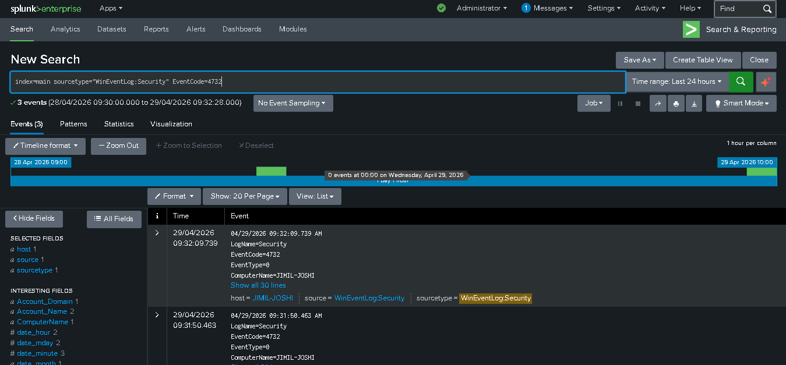
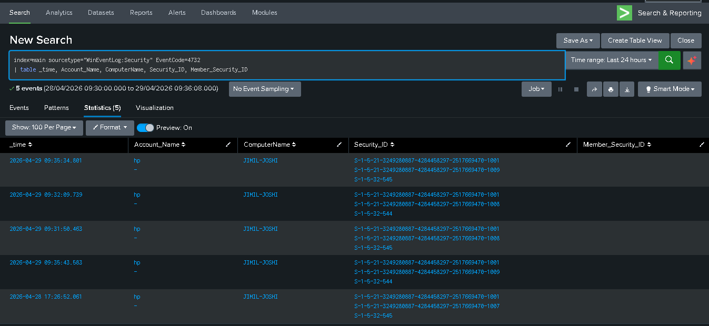

---

## 🧪 Lab 5 — RDP & Interactive Login Detection
### SPL Query
```spl
index=main sourcetype="WinEventLog:Security" EventCode=4624
| where Logon_Type=2
| stats count by Account_Name, ComputerName, Logon_Type
| sort -count
```
### Result
Splunk detected **4 successful interactive logins** by `hp` on `JIMIL-JOSHI`.
📄 [Full Investigation Report](Investigation-Reports/rdp_login_investigation.md)
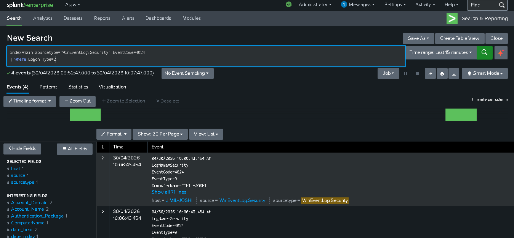
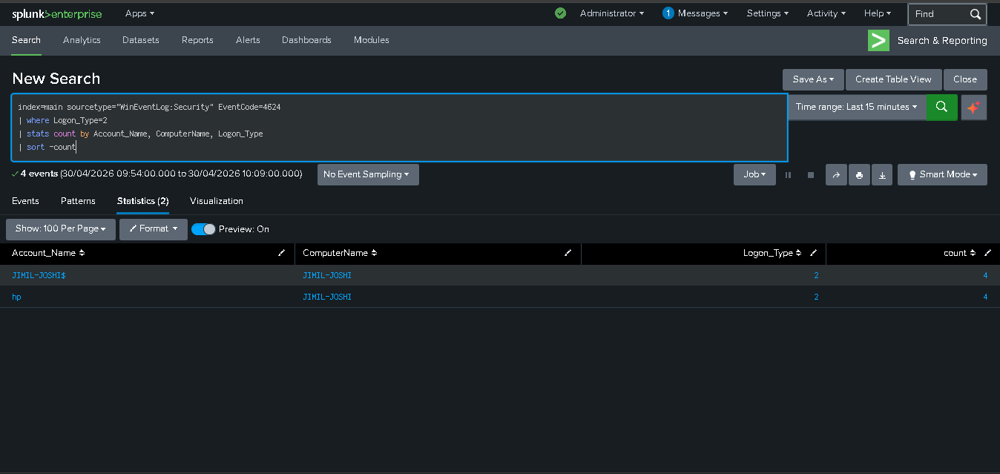

---

## 🧪 Lab 6 — Suspicious PowerShell + Threat Hunting
### Part 1 — Basic Recon
```spl
index=main EventCode=4104
| table _time, ComputerName, Message
| sort -_time
```
### Part 2 — Advanced Threat Hunting
```spl
index=main EventCode=4104
| search Message="*Invoke*" OR Message="*WebClient*" OR Message="*ToBase64*" OR Message="*payload*"
| table _time, ComputerName, Message
| sort -_time
```
📄 [Full Investigation Report](Investigation-Reports/powershell_investigation_v2.md)
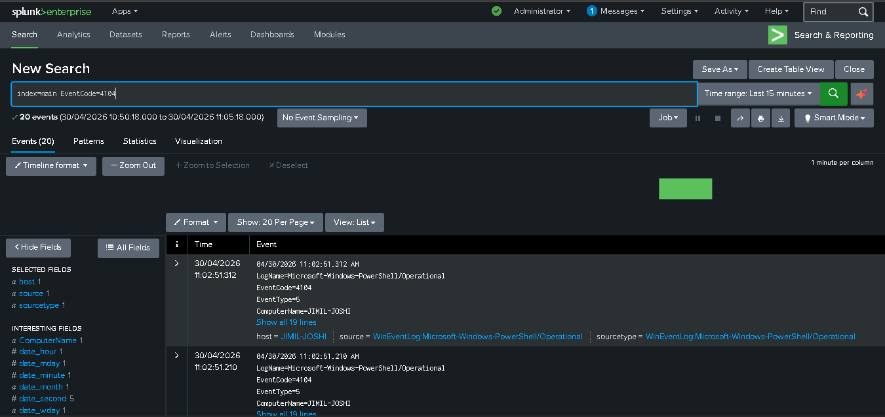
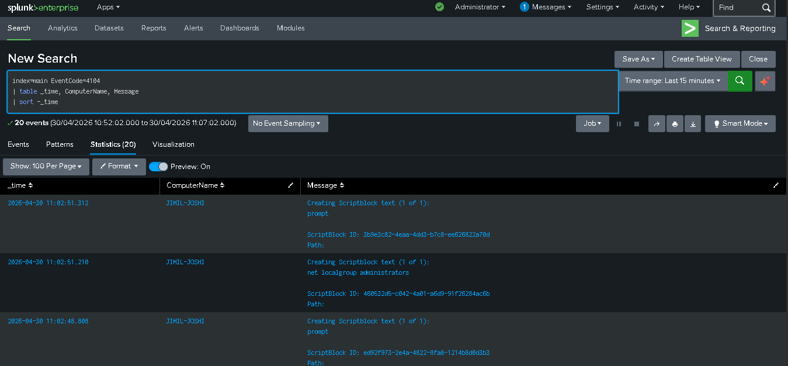
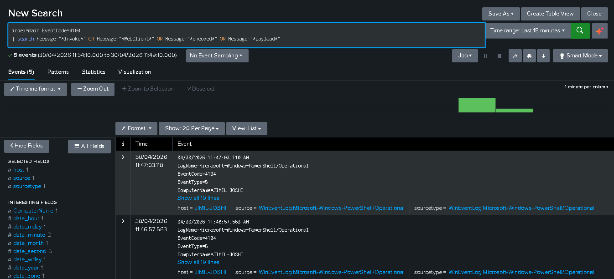
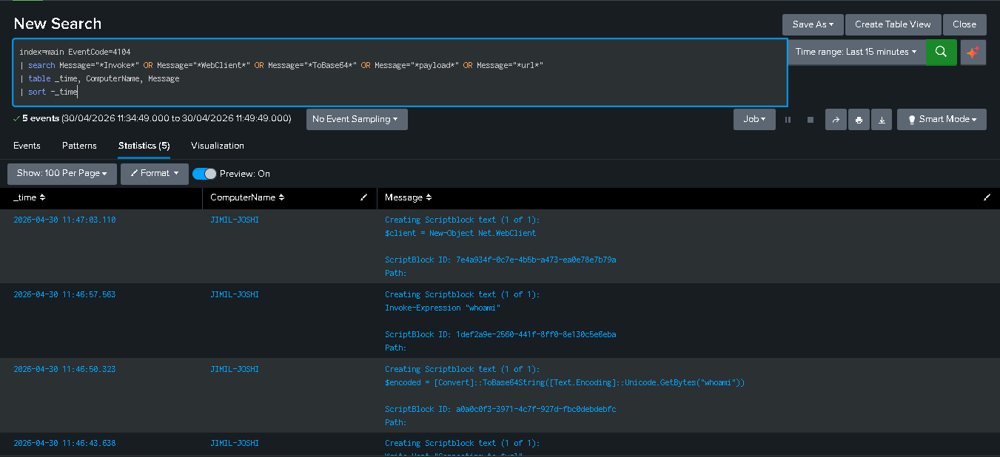

---

## 🧪 Lab 7 — Process Creation Detection
### SPL Query
```spl
index=main sourcetype="WinEventLog:Security" EventCode=4688
| search New_Process_Name="*cmd.exe*" OR New_Process_Name="*net.exe*" OR New_Process_Name="*whoami*"
| table _time, Account_Name, New_Process_Name, Process_Command_Line
| sort -_time
| head 10
```
### Result
Splunk detected **613 process events** with `whoami` and `net localgroup administrators` confirmed.
📄 [Full Investigation Report](Investigation-Reports/process_creation_investigation.md)
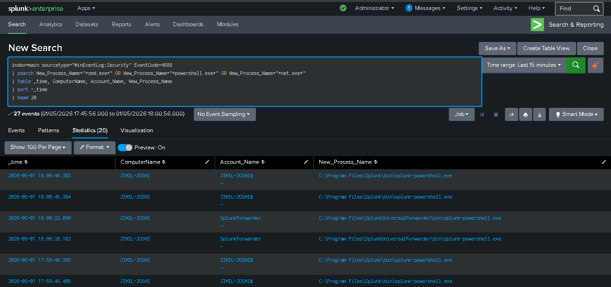
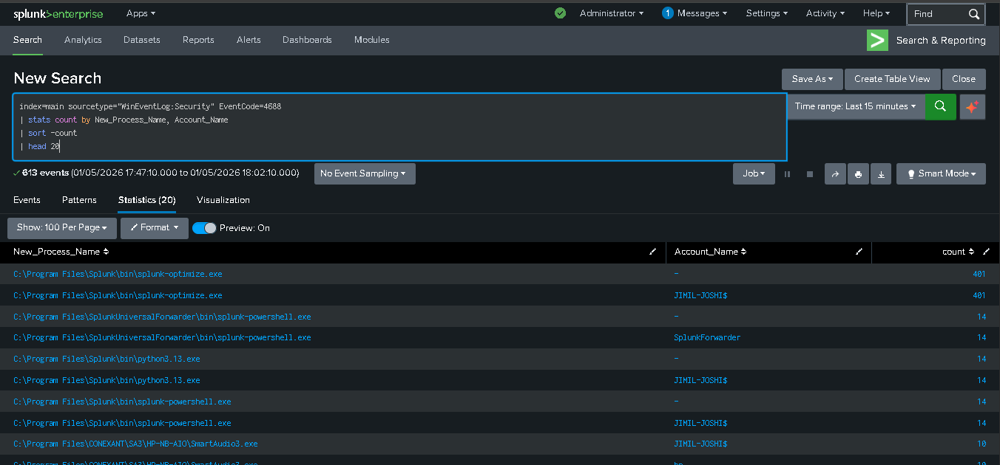
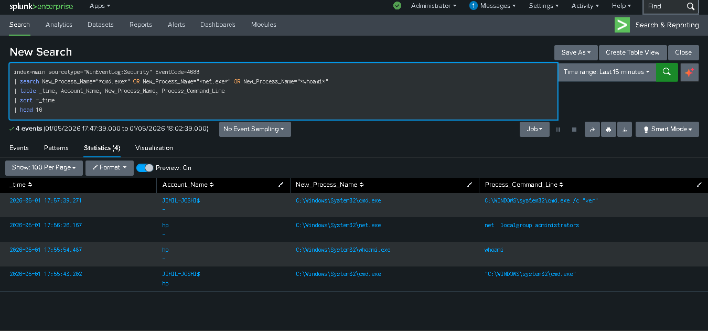

---

## 🧪 Lab 8 — Log Clearing Detection
### SPL Query
```spl
index=main sourcetype="WinEventLog:Security" EventCode=1102
| table _time, ComputerName, Account_Name, Message
| sort -_time
```
### Result
Splunk detected **2 log clearing events** — "The audit log was cleared" confirmed.
📄 [Full Investigation Report](Investigation-Reports/log_clearing_investigation.md)
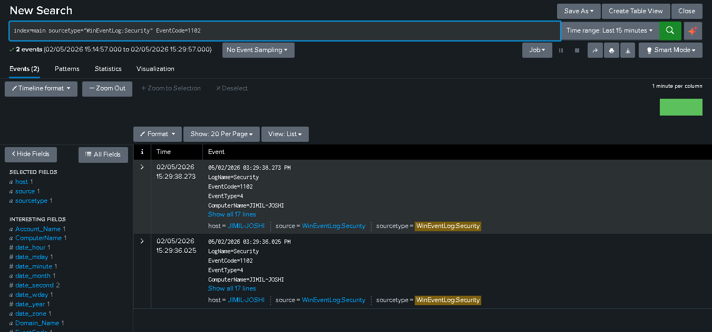
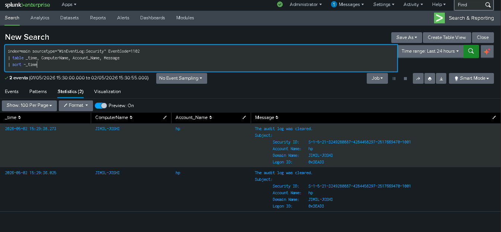

---

## 🧪 Lab 9 — Windows Firewall Disabled
### SPL Query
```spl
index=main EventCode=4104
| search Message="*NetFirewall*" OR Message="*Enabled False*" OR Message="*Enabled True*"
| table _time, ComputerName, Message
| sort -_time
| head 20
```
### Result
Splunk detected **74 firewall-related events** — `Set-NetFirewallProfile -Enabled False` confirmed.
📄 [Full Investigation Report](Investigation-Reports/firewall_disabled_investigation.md)
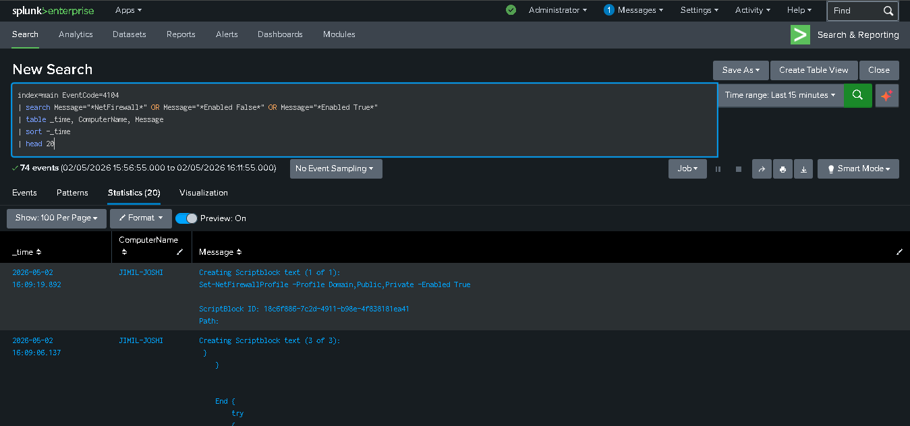
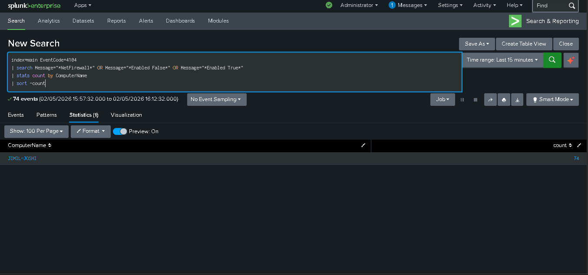

---

## 🧪 Lab 10 — Scheduled Task Created
### SPL Query
```spl
index=main EventCode=4104
| search Message="*schtasks*" OR Message="*ScheduledTask*" OR Message="*WindowsUpdate*"
| table _time, ComputerName, Message
| sort -_time
| head 20
```
### Result
Splunk detected **27 events** including suspicious task `WindowsUpdate` on `JIMIL-JOSHI`.
📄 [Full Investigation Report](Investigation-Reports/scheduled_task_investigation.md)
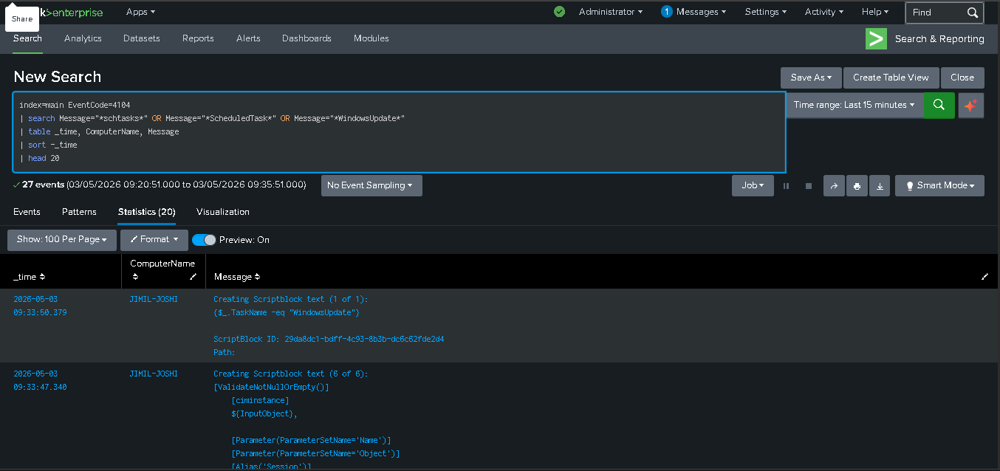
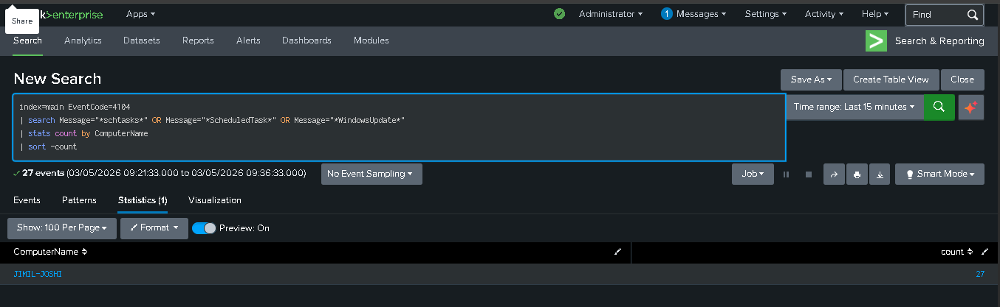

---

## 🧪 Lab 11 — Malicious Service Installed
### SPL Query
```spl
index=main sourcetype="WinEventLog:System" EventCode=7045
| table _time, ComputerName, Message
| sort -_time
```
### Result
Splunk detected `FakeService` with binary `cmd.exe /c whoami` — auto start as LocalSystem.
📄 [Full Investigation Report](Investigation-Reports/service_installed_investigation.md)
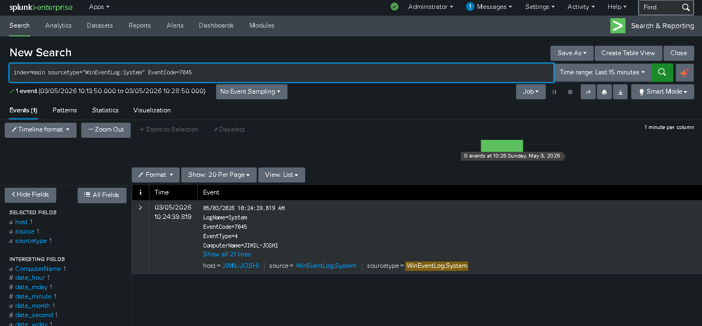
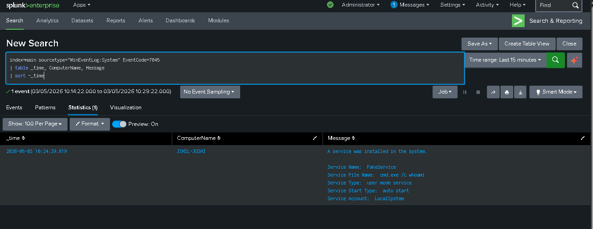

---

## 🧪 Lab 12 — Port Scan Detection
### SPL Query
```spl
index=main sourcetype="firewall_log"
| rex field=_raw "(?P<action>\w+)\s+(?P<protocol>\w+)\s+(?P<src_ip>[\d.]+)\s+(?P<dst_ip>[\d.]+)\s+(?P<src_port>\d+)\s+(?P<dst_port>\d+)"
| stats count by dst_port, action
| sort -count
| head 20
```
### Result
Splunk detected **1,527 firewall events** — port scan from `127.0.0.1` across 1024 ports confirmed.
📄 [Full Investigation Report](Investigation-Reports/port_scan_investigation.md)
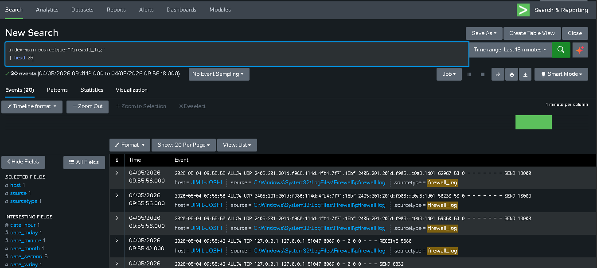
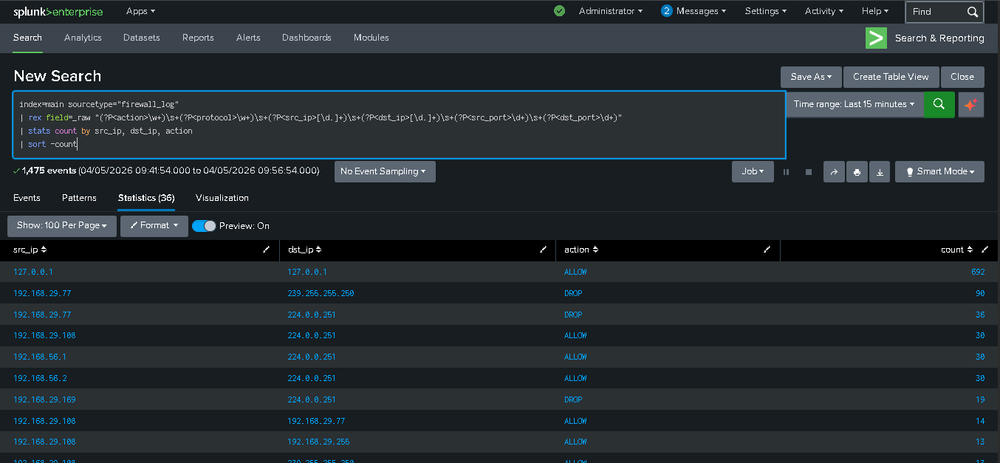
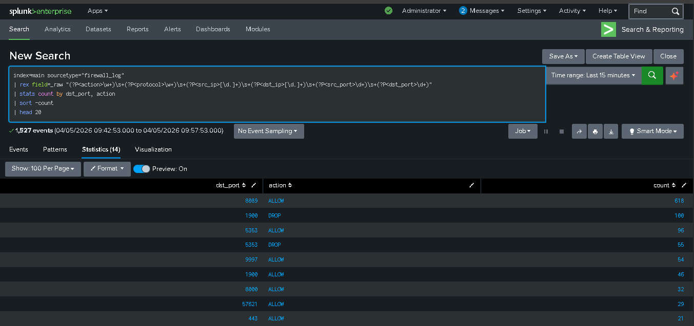

---

## 🧪 Lab 13 — DNS Query Analysis
### SPL Query
```spl
index=main sourcetype="WinEventLog:Microsoft-Windows-DNS-Client/Operational"
| rex field=_raw "(?P<domain>[a-zA-Z0-9.-]+\.[a-zA-Z]{2,})"
| stats count by domain
| sort -count
| head 20
```
### Result
Splunk detected **853 DNS events** including suspicious query for `suspicious-domain.xyz`.
📄 [Full Investigation Report](Investigation-Reports/dns_analysis_investigation.md)
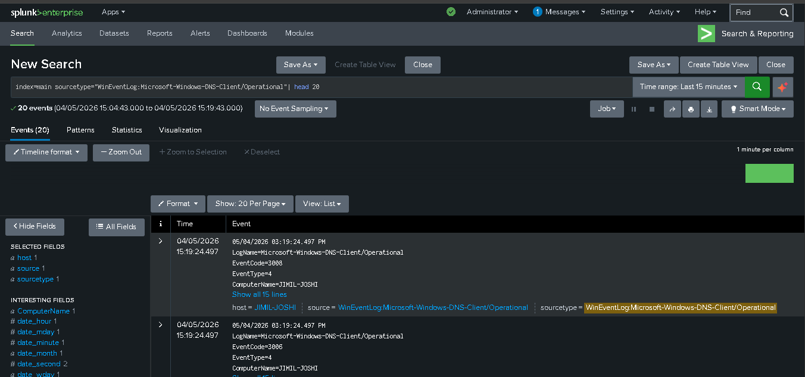
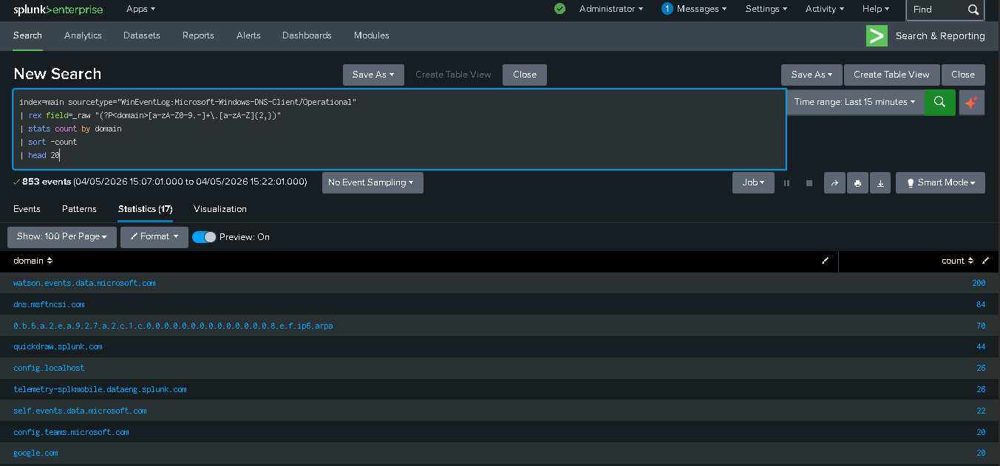
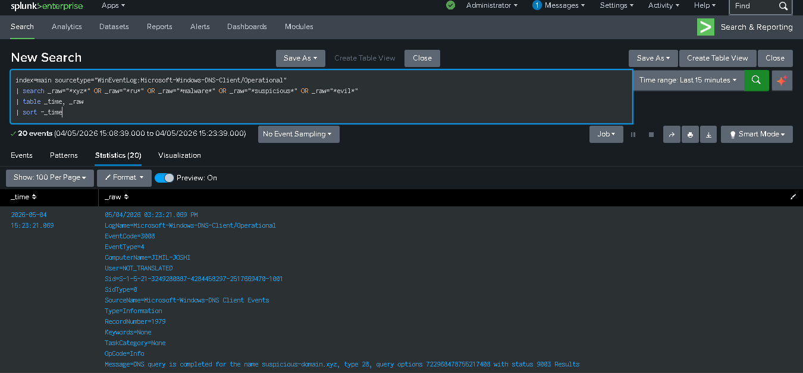

---

## 🧪 Lab 14 — SOC Security Dashboard

### Dashboard Metrics

| Panel | Count |
|---|---|
| Failed Login Attempts | 38 |
| New User Accounts Created | 4 |
| Log Clearing Events | 2 |
| Privilege Escalation Events | 10 |
| Malicious Services Installed | 16 |
| Account Lockouts | 1 |
| PowerShell Events | 679 |
| Suspicious PowerShell Commands | 32 |

📄 [Full Dashboard Report](Investigation-Reports/soc_dashboard_report.md)
📄 [Dashboard XML](Dashboards/soc_security_dashboard.xml)
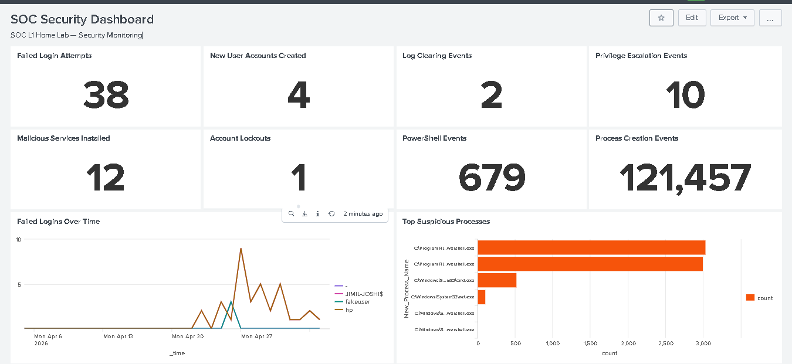
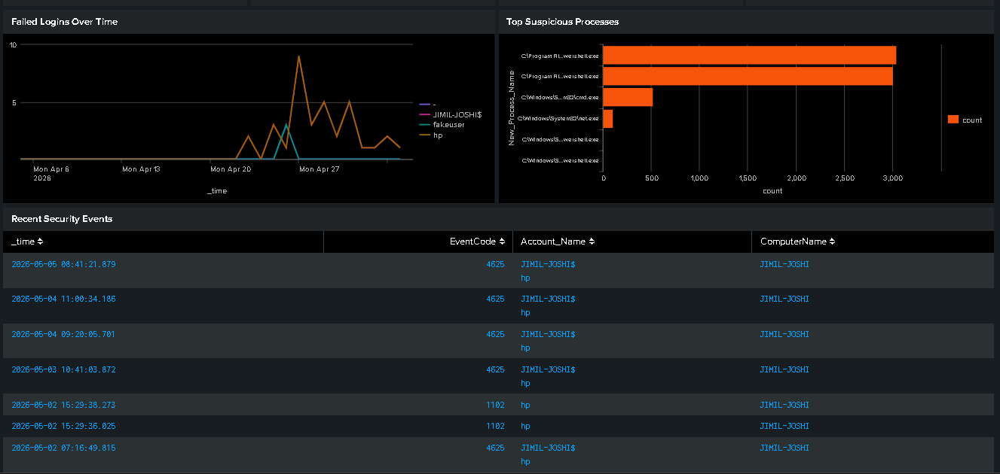


---

## 🧪 Lab 15 — Splunk Alerts

### Alerts Created

| Alert | Event ID | Severity | Status |
|---|---|---|---|
| Brute Force Detection | 4625 | 🟠 High | ✅ Enabled |
| Log Clearing — Critical | 1102 | 🔴 Critical | ✅ Enabled |
| New User Created | 4720 | 🟠 High | ✅ Enabled |
| Privilege Escalation | 4732 | 🔴 Critical | ✅ Enabled |
| Malicious Service Installed | 7045 | 🔴 Critical | ✅ Enabled |

### Result
Brute Force alert triggered **6 times** confirming automated detection is working!
📄 [Full Alerts Report](Investigation-Reports/splunk_alerts_report.md)
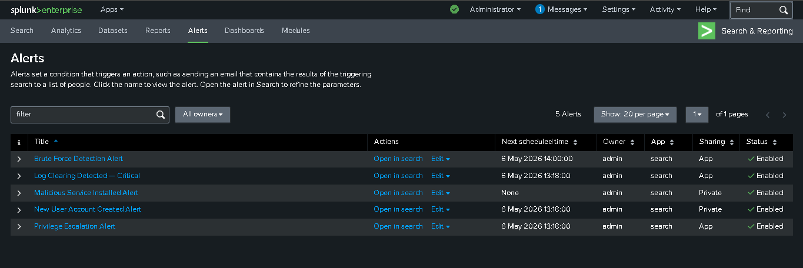
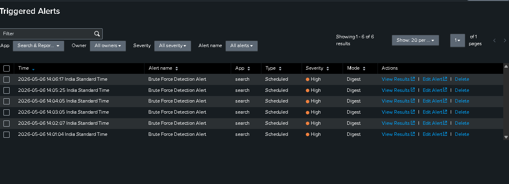

---

## 🧪 Lab 16 — Advanced Correlation Rules

### What I Did
- Built 3 advanced correlation rules connecting multiple events
- Detected complete attack chains — not just individual events
- Identified brute force success, backdoor admin creation and evidence destruction

### Correlation Rule 1 — Brute Force Then Successful Login
```spl
index=main sourcetype="WinEventLog:Security"
| eval event_type=case(EventCode="4625","Failed Login", EventCode="4624","Successful Login")
| where isnotnull(event_type)
| stats count(eval(EventCode="4625")) as failed_count, count(eval(EventCode="4624")) as success_count by Account_Name, ComputerName
| where failed_count >= 3 AND success_count >= 1
| eval risk="HIGH — Possible Successful Brute Force!"
| table Account_Name, ComputerName, failed_count, success_count, risk
```
**Result:** Account `hp` — 18 failed + 12 successful logins 🔴

### Correlation Rule 2 — Backdoor Admin Account Created
```spl
index=main sourcetype="WinEventLog:Security" EventCode=4720 OR EventCode=4732
| stats count(eval(EventCode="4720")) as new_user, count(eval(EventCode="4732")) as added_to_admin by Account_Name, ComputerName
| where new_user >= 1 AND added_to_admin >= 1
| eval risk="CRITICAL — Backdoor Admin Account Created!"
| table Account_Name, ComputerName, new_user, added_to_admin, risk
```
**Result:** Account `hp` — 2 new users + 3 added to Admins 🔴

### Correlation Rule 3 — Attack Then Evidence Destroyed
```spl
index=main sourcetype="WinEventLog:Security" EventCode=4625 OR EventCode=1102
| stats count(eval(EventCode="4625")) as failed_logins, count(eval(EventCode="1102")) as log_cleared by Account_Name, ComputerName
| where failed_logins >= 3 AND log_cleared >= 1
| eval risk="CRITICAL — Attack then Evidence Destroyed!"
| table Account_Name, ComputerName, failed_logins, log_cleared, risk
```
**Result:** Account `hp` — 18 failed logins + 3 log clearing events 🔴

📄 [Full Investigation Report](Investigation-Reports/correlation_rules_investigation.md)
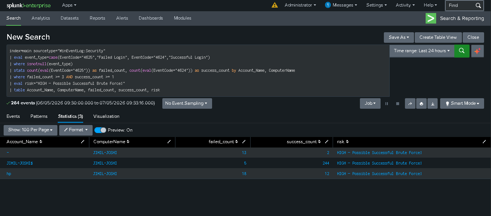
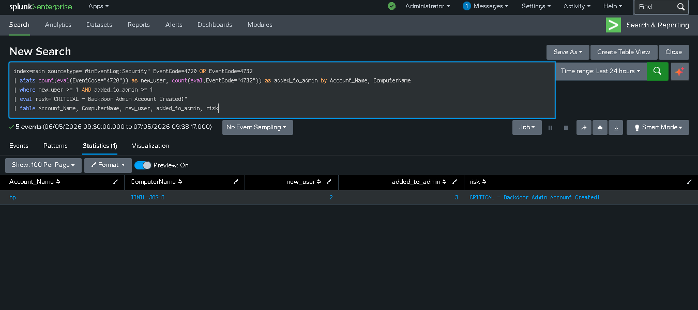
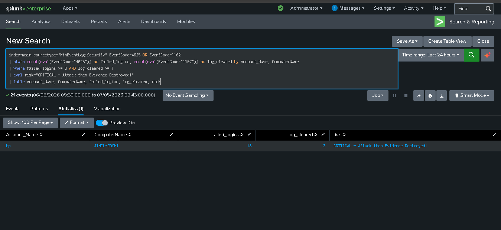

---

## 🎯 Skills Demonstrated

- Windows Security & System Event Log analysis
- PowerShell Script Block Log analysis
- Windows Firewall Log analysis
- DNS Query Log analysis
- Process Creation & Command Line logging
- Anti-forensics detection
- Defense evasion detection
- Persistence technique detection
- Privilege escalation detection
- Malicious service detection
- Scheduled task abuse detection
- Port scan detection
- DNS C2 communication detection
- Advanced correlation rule development
- Multi-event attack chain detection
- SPL query writing and optimization
- SPL regex field extraction
- Splunk Dashboard creation
- Splunk Alert configuration and tuning
- Automated SOC alerting
- Layered detection strategy
- Living off the Land (LOL) attack detection
- MITRE ATT&CK framework mapping
- Incident documentation and reporting
- Threat hunting for advanced attacker techniques

---

## 📬 Connect

**Jimil Joshi** — Aspiring SOC Analyst
🔗 [GitHub](https://github.com/jimil-joshi-8115)
