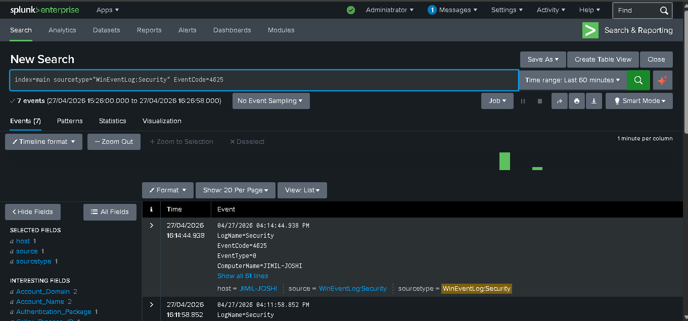
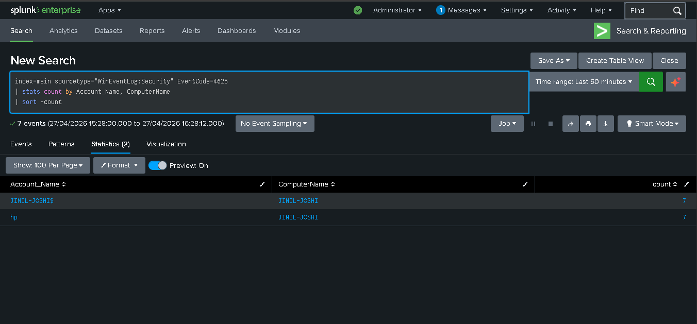
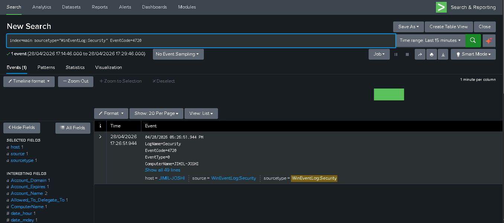
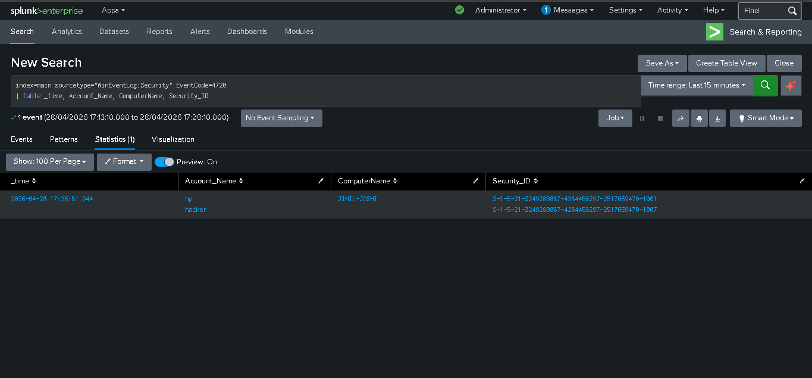
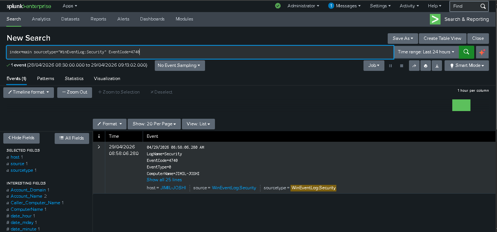
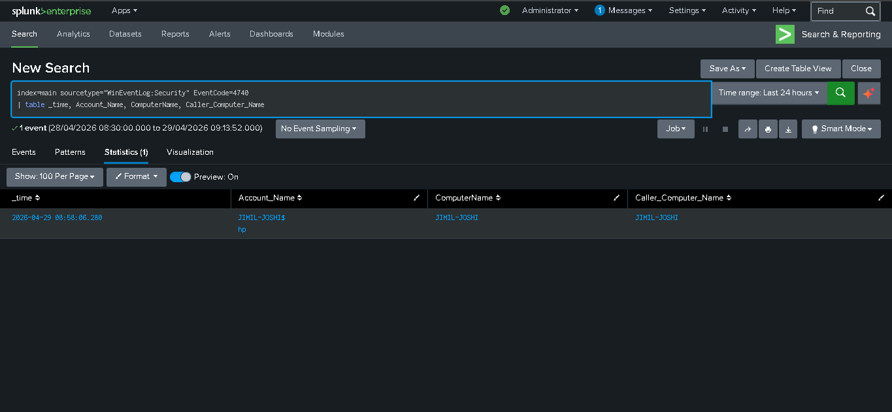

# 🛡️ SOC Level 1 — Splunk Home Lab

> A hands-on SOC L1 home lab built to practice real-world threat detection, log analysis, and incident investigation using Splunk SIEM.

---

## 👨‍💻 About This Project

This repository documents my SOC Level 1 home lab where I simulate attacks on my own machine and use **Splunk** to detect, investigate, and report on them — just like a real SOC analyst would.

**Tools Used:**
- Splunk Enterprise (local)
- Windows Security Event Logs
- MITRE ATT&CK Framework

---

## 📁 Repository Structure

```
SOC-Lab-Splunk/
│
├── README.md
│
├── SPL-Queries/
│   ├── brute_force_detection.spl
│   ├── new_user_detection.spl
│   └── account_lockout_detection.spl
│
├── Investigation-Reports/
│   ├── brute_force_investigation.md
│   ├── new_user_investigation.md
│   └── account_lockout_investigation.md
│
└── screenshots/
    ├── 01_raw_events.png
    ├── 02_stats_table.png
    ├── 03_new_user_raw_event.png
    ├── 04_new_user_table.png
    ├── 05_lockout_raw_event.png
    └── 06_lockout_table.png
```

---

## 🔍 Investigations

| # | Attack Simulated | Event ID | MITRE ATT&CK | Status |
|---|---|---|---|---|
| 1 | Brute Force Login | 4625 | T1110 | ✅ Completed |
| 2 | New User Account Created | 4720 | T1136 | ✅ Completed |
| 3 | Account Lockout | 4740 | T1110 | ✅ Completed |

---

## 🧪 Lab 1 — Brute Force Detection

### What I Did
- Simulated multiple failed login attempts on Windows machine
- Used Splunk to search for Event ID 4625
- Wrote SPL query to detect and count failed logins per account
- Documented full investigation report

### SPL Query
```spl
index=main sourcetype="WinEventLog:Security" EventCode=4625
| stats count by Account_Name, ComputerName
| where count >= 5
| sort -count
```

### Result
Splunk successfully detected **7 failed login attempts** against account `hp` on host `JIMIL-JOSHI` within a 60 minute window.

📄 [Full Investigation Report](Investigation-Reports/brute_force_investigation.md)

### Screenshots



---

## 🧪 Lab 2 — New User Account Created (Persistence)

### What I Did
- Simulated attacker creating a backdoor local user account
- Used Splunk to detect Event ID 4720
- Identified who created the account, when and on which machine
- Documented full investigation report

### SPL Query
```spl
index=main sourcetype="WinEventLog:Security" EventCode=4720
| table _time, Account_Name, ComputerName, Security_ID
```

### Result
Splunk successfully detected creation of backdoor account `hacker` by account `hp` on host `JIMIL-JOSHI`.

📄 [Full Investigation Report](Investigation-Reports/new_user_investigation.md)

### Screenshots



---

## 🧪 Lab 3 — Account Lockout Detection

### What I Did
- Enabled Windows account lockout policy (threshold = 3)
- Simulated brute force until account locked out
- Used Splunk to detect Event ID 4740
- Identified locked account, machine and timestamp
- Reset lockout policy back to 0 after lab

### SPL Query
```spl
index=main sourcetype="WinEventLog:Security" EventCode=4740
| table _time, Account_Name, ComputerName, Caller_Computer_Name
```

### Result
Splunk successfully detected account lockout of `hp` on host `JIMIL-JOSHI` at 08:58:06 on 29/04/2026.

📄 [Full Investigation Report](Investigation-Reports/account_lockout_investigation.md)

### Screenshots



---

## 🎯 Skills Demonstrated

- Windows Event Log analysis
- Splunk SPL query writing
- Threat detection and investigation
- MITRE ATT&CK framework mapping
- Incident documentation and reporting
- Persistence technique detection
- Account lockout investigation

---

## 🚀 Coming Next

- [ ] User Added to Admin Group (Event ID 4732)
- [ ] RDP Login Detection (Event ID 4624)
- [ ] Suspicious PowerShell (Event ID 4104)
- [ ] Process Creation (Event ID 4688)
- [ ] Log Clearing (Event ID 1102)
- [ ] Windows Firewall Disabled (Event ID 4950)
- [ ] Scheduled Task Created (Event ID 4698)
- [ ] Service Installed (Event ID 7045)
- [ ] Port Scan Detection
- [ ] DNS Query Analysis
- [ ] Splunk Dashboard
- [ ] Splunk Alerts
- [ ] Correlation Rules

---

## 📬 Connect

**Jimil Joshi** — Aspiring SOC Analyst
🔗 [GitHub](https://github.com/jimil-joshi-8115)
